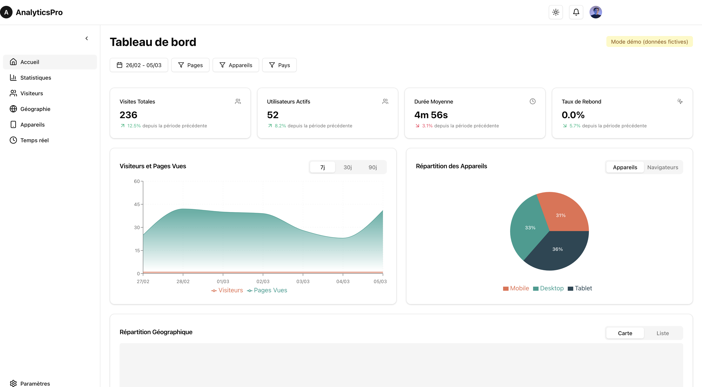
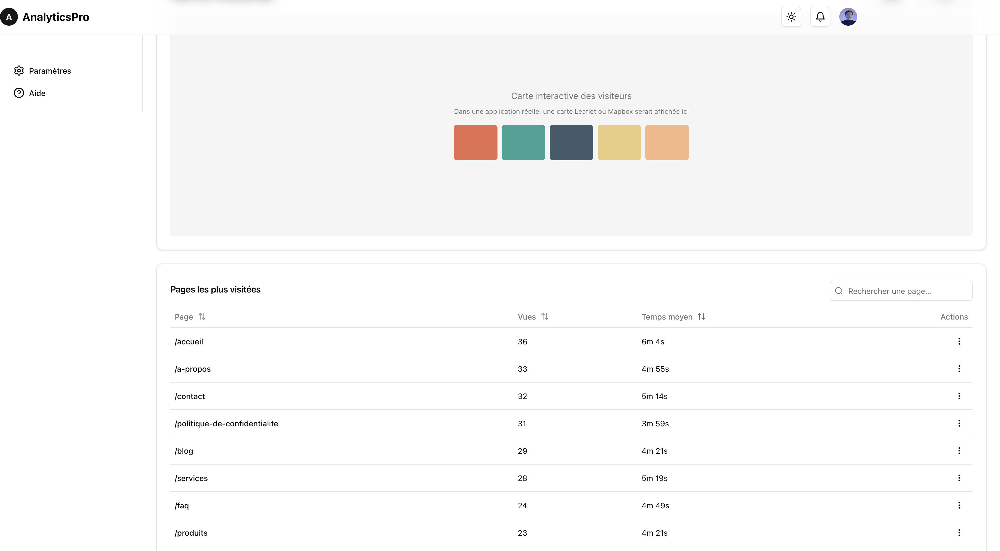

# Analytics Dashboard

Une application de tableau de bord d'analyse pour suivre le trafic d'un site web en temps réel.




## Fonctionnalités

- Tableau de bord interactif avec ShadCN/UI et Tailwind CSS
- Visualisation des données avec Recharts
- Filtrage avancé des données
- Mises à jour en temps réel avec Socket.io
- Backend Express avec MongoDB
- API RESTful pour les données d'analyse
- Mode démo avec données fictives si le serveur n'est pas disponible

## Structure du projet

- `src/` - Code source frontend (React)
- `server/` - Code source backend (Express)
  - `models/` - Modèles MongoDB
  - `routes/` - Routes API
- `public/` - Fichiers statiques

## Installation

1. Cloner le dépôt
2. Installer les dépendances

```bash
npm install
```

3. Configurer les variables d'environnement (copier `.env.example` vers `.env`)

## Démarrage

### Développement

Pour démarrer le serveur de développement frontend:

```bash
npm run dev
```

Pour démarrer le serveur backend:

```bash
npm run dev:server
```

### Production

Pour construire l'application pour la production:

```bash
npm run build
```

Pour démarrer le serveur en production:

```bash
npm run server
```

## API

L'API est disponible sur `http://localhost:5000/api` avec les endpoints suivants:

- `/visits` - Données des visites
- `/pages` - Statistiques des pages
- `/stats` - Statistiques générales

## Websockets

Les mises à jour en temps réel sont gérées via Socket.io sur `http://localhost:5000`.

## Licence

MIT
